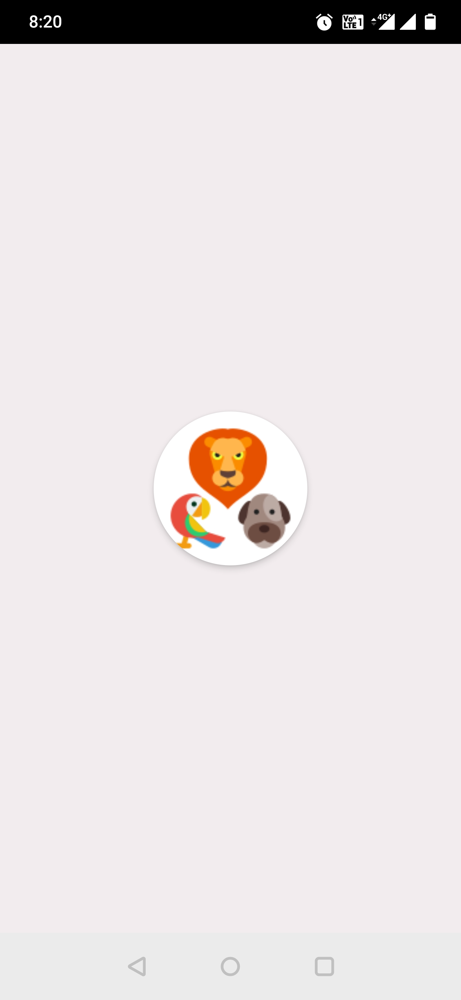
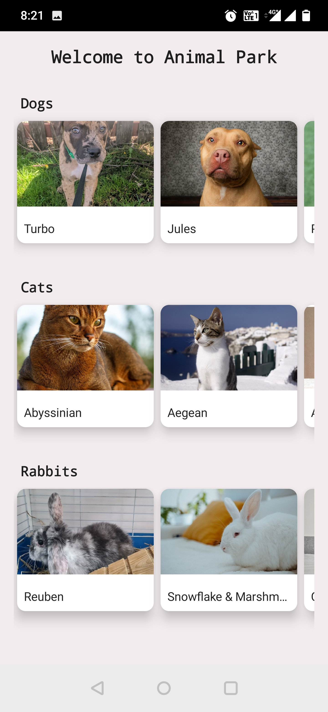
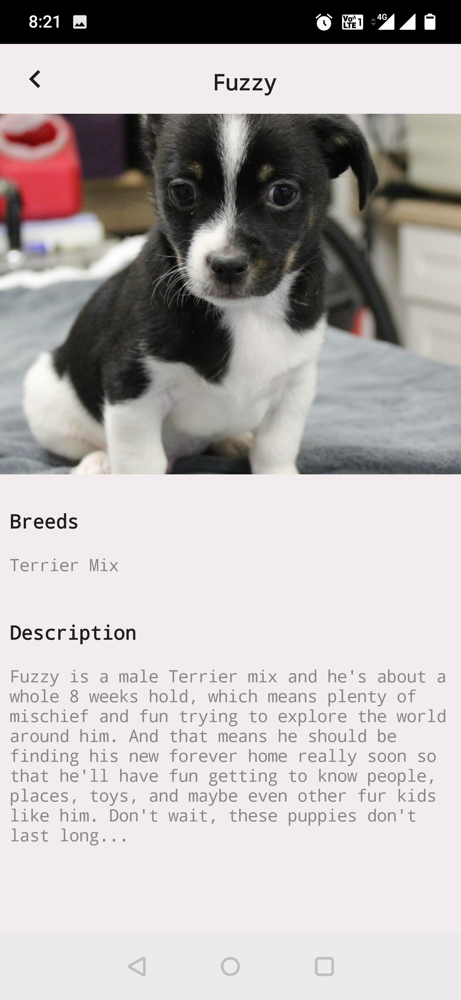

# JetpackCompose - Android Clean Architecture

Sample app that display list of Animals.The Purpose of the project to illustrate the usage of Jetpack Compose with clean architecture.
 

Including:
* Jetpack Compose
* MVVM Architecture
* DaggerHilt
* Coroutines
* Flow

### Application Architecture
---
- IDE: Android Studio
- Programming Language: Kotlin
- Architecture: MVVM architecture using Modular & Use Case 
- Third Party Libraries: Jetpack Compose, Coroutines, Flow, DaggerHilt, Navigation Component, Retrofit, Coil

 

## Screenshots
||||
|:----:|:----:|:----:|